# imagespec

Render images from a declarative **YAML/dict spec** — shapes, text, charts,
QR/barcodes — for e-paper ESL tags and label printers.

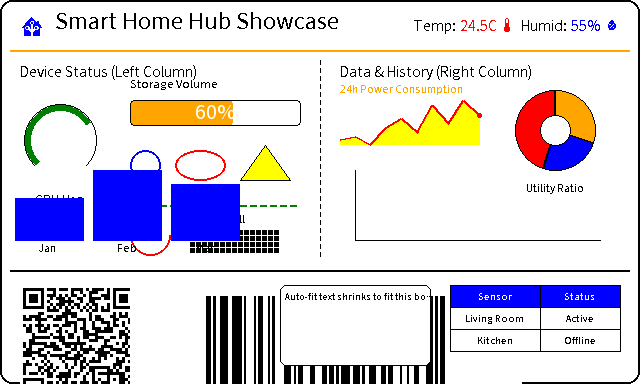

This is the shared rendering core extracted from
[`hass-gicisky`](https://github.com/eigger/hass-gicisky) and
[`hass-niimbot`](https://github.com/eigger/hass-niimbot). Both integrations had
near-identical renderers that had drifted apart; `imagespec` unifies them and
removes the Home Assistant dependency so the engine can be reused and tested
standalone.

## Status

✅ **26 elements** (21 ported + 5 new) rendering, with a 74-test suite.
Architecture (HA-decoupled context, registry dispatch, device-specific rotation
+ palette) is in place. Remaining work is packaging polish and switching the two
components over to it.

## Design

- **No framework dependency.** The core never imports Home Assistant. Anything
  host-specific is injected through `RenderContext`:
  - `font_resolver(name) -> path | None` — e.g. an integration's
    `hass.config.path("www/fonts")` lookup.
  - `history_provider(entity_ids, start, end) -> states` — for the `plot`
    element (HA recorder). Optional.
  - `palette` — the device's supported colors (see below).
- **Registry dispatch.** Each element `type` is a handler registered with
  `@element("type")` in `imagespec/elements/`, replacing the original giant
  `if/elif` chain. Adding an element = adding a function.
- **`RenderState`.** Threaded through handlers; holds the (reassignable) `img`
  and the `pos_y` flow cursor.
- **Device-dependent palette** (`RenderContext.palette`), *not* unified — panels
  support different colors. Define it as a **list of the colors the device
  supports** (names, HEX, or RGBA tuples):

  ```python
  RenderContext(palette=["black", "white", "red"])          # names
  RenderContext(palette=["#000000", "#ffffff", "#ff0000"])  # HEX
  RenderContext(palette=[(0, 0, 0), (255, 255, 255)])       # RGBA tuples
  ```

  Shorthand names are optional convenience for common panels: `"2"`/`"bw"`,
  `"3"`/`"bwr"`, `"4"`, `"7"`/`"acep"`. Any requested color in a payload is then
  quantized to the nearest color in this list — on a 2-color device `red`
  becomes black; on 4-color a blue `#1e90ff` becomes white; on 7-color it stays
  blue.
- **Merged behaviour.** Where the two sources differed, the superset wins:
  - qrcode gains `eclevel` (niimbot)
- **Device-dependent rotation** (`rotate_mode`), *not* unified — both behaviours
  are kept because they are physically different:
  - `"canvas"` (gicisky): background/canvas rotates; output stays `width×height`
    (fixed-resolution e-ink panel).
  - `"image"` (niimbot): drawing rotates; output dimensions swap (variable-size
    label printer).

## Usage

```python
from imagespec import render, RenderContext

ctx = RenderContext(
    font_resolver=my_font_lookup,        # optional
    history_provider=my_history_lookup,  # optional, only for `plot`
)
image = render(payload, width=296, height=128, rotate=0,
               background="white", context=ctx)   # -> PIL.Image (RGB)
```

Run the smoke test (no fonts required):

```bash
pip install -e .
python examples/smoke_test.py
```

## Development & testing

```bash
pip install -e ".[dev,datamatrix]"
pytest                 # 74 tests: every element, palettes, rotation, dither, errors
ruff check . && ruff format --check .   # lint + format
python -m build        # build sdist + wheel (bundles fonts/icons)
```

CI runs on every push/PR (`.github/workflows/ci.yml`): ruff lint+format, the test
suite on Python 3.11/3.12/3.13, and a build that asserts the bundled fonts/icons
are present in the wheel. Pushing a `v*` tag triggers
`.github/workflows/release.yml` to build and publish to PyPI (trusted publishing).

The test matrix (`tests/test_elements.py`) asserts it covers *every* registered
element type, so adding a new `@element(...)` without a sample fails the suite —
keeping coverage exhaustive by construction.

**Robustness built in:**

- Each handler error is wrapped with element context — you get
  `error rendering element #3 (type 'text'): ...`, not a raw PIL traceback.
- `render()` validates `rotate`/`rotate_mode`/size and rejects non-dict elements;
  unknown element types are warned-and-skipped.
- `dlimg` only allows `http(s)`/`data:` URLs by default; local paths require
  `RenderContext(allow_local_images=True)`. Network failures become `RenderError`.
- Clear errors for missing required args, invalid barcode symbology, malformed
  `polygon` points, and a `diagram` too small for its bars.

## Elements

All ported from the original renderers (superset behaviour where they differed):

| Preview | Element | Module | Notes |
|:---:|---|---|---|
| 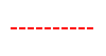 | `line` | shapes | + dashed lines |
|  | `rectangle` | shapes | |
| 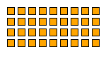 | `rectangle_pattern` | shapes | |
| 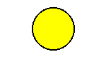 | `circle` | shapes | |
| 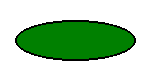 | `ellipse` | shapes | |
| 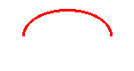 | `arc` | shapes | |
| 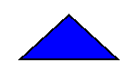 | `polygon` | shapes | |
| 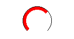 | `gauge` | shapes | |
| 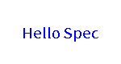 | `text` | text | + rotation, background box |
| 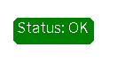 | `text_box` | text | |
| 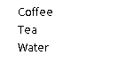 | `multiline` | text | |
| 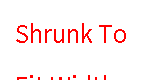 | `new_multiline` | text | fit-to-width/height autosize (niimbot) |
| 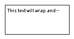 | `text_fit` | text | fit text into a fixed box: shrink font / ellipsis / wrap |
| 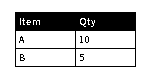 | `table` | text | |
|  | `qrcode` | codes | + `eclevel` (niimbot) |
| 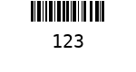 | `barcode` | codes | |
| 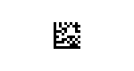 | `datamatrix` | codes | optional dep `pyStrich` (`imagespec[datamatrix]`) |
|  | `icon` | media | Material Design Icons; needs bundled `icons/` assets |
|  | `dlimg` | media | + fit modes (stretch/fit/fill/contain) |
| 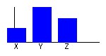 | `diagram` | charts | bar chart |
| 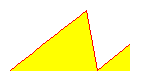 | `plot` | charts | needs `history_provider`; + area_fill, xlegend |
| 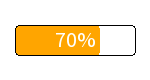 | `progress_bar` | charts | + rounded corners |
| 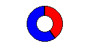 | `pie` | charts | **new** — pie / donut (`inner_radius`) |
|  | `sparkline` | charts | **new** — compact axis-less line from inline values |
|  | `rich_text` | text | **new** — inline spans: icon + text + color on one line |
| 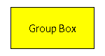 | `group` | layout | **new** — container: child elements at an offset, clipped, optionally rotated |

Plus enhancements: `dlimg` gained `dither` (Floyd–Steinberg to palette) and
`circle`/`mask` (circular crop); `render(..., dither=True)` dithers the whole
output; `text_fit` fits text into a fixed box (shrink / ellipsis / wrap).

### Dithering

`imagespec` supports Floyd–Steinberg dithering to trade spatial resolution for perceived color depth. This is crucial for rendering detailed gradients, shaded spheres, or photo elements on limited-palette screens (like 2-color black/white, 3-color BWR, or 7-color ACeP e-paper panels).

Without dithering, colors are mapped to the nearest palette entry (direct quantization), leading to severe color banding.

#### 1. Gradient & 3D Shading
Dithering creates a natural halftone pattern that simulates smooth shading and eliminates color banding.
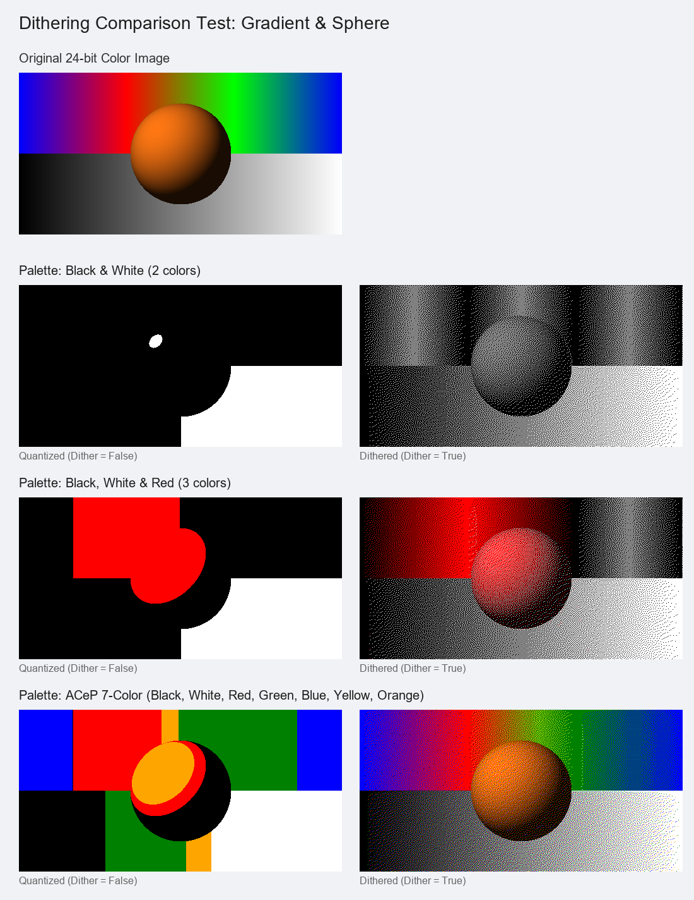

#### 2. Font Rendering (Anti-aliasing vs. Dithering)
> [!IMPORTANT]
> **Guidelines for Text:** Avoid dithering on text layers. Dithering anti-aliased font edges creates tiny dot noise, which severely degrades readability on low-resolution e-ink screens. For sharp text, use direct quantization or disable anti-aliasing (`fontmode = "1"`). The built-in `text` element enforces `fontmode = "1"` for this reason.
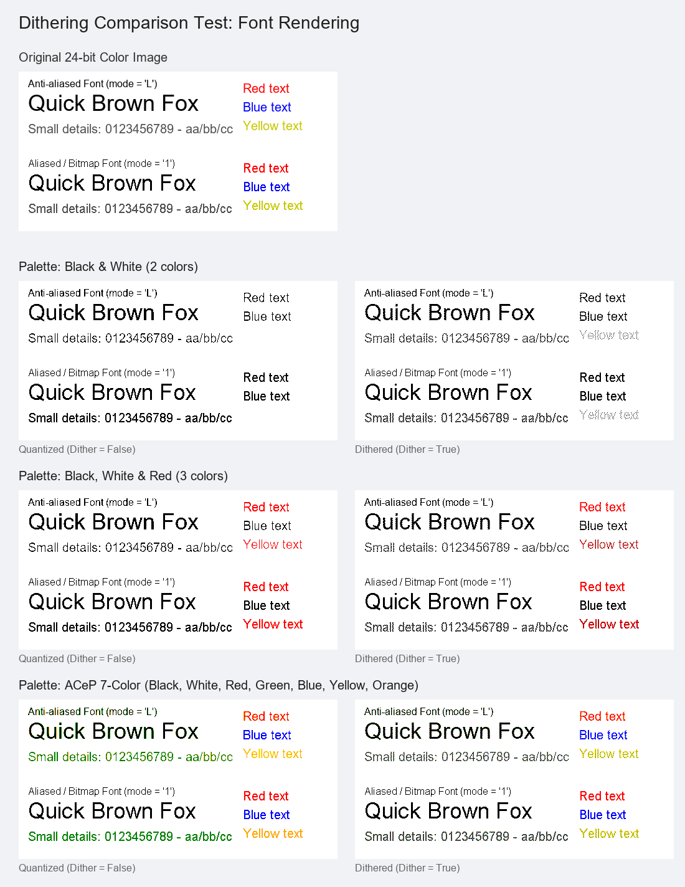

#### 3. Charts & Solid Fills
Dithering is useful when you have solid color regions (like pie slices or bar diagrams) in colors outside your device palette (e.g. orange on a black/white screen). Dithering simulates these colors with dot patterns to help distinguish segments, though it introduces some edge noise.
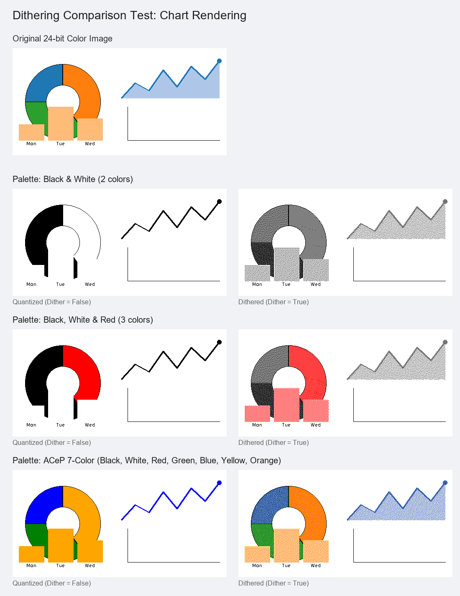

To run the dithering comparison generator yourself:
```bash
python examples/compare_dither.py
```

## Fonts & assets

Bundled in the package (offline baseline):

- `icons/materialdesignicons-webfont.ttf` + `_meta.json` — required by `icon`.
- `fonts/NotoSansKR-Regular.ttf` (default) and `fonts/ppb.ttf` (niimbot default).

Anything else is resolved at runtime, in order: `font_resolver` (host) →
bundled font of the same basename → bundled default. Helpers in
`imagespec.resolvers`:

- `directory_resolver(dir)` — look up fonts in a host directory (e.g. `www/fonts`).
- `caching_resolver(cache_dir, sources)` — **download on first use, cache to
  disk, reuse offline** (internet needed only once per font).
- `chain_resolvers(a, b, ...)` — try several in order.

This is why the core bundles only the essentials (~11 MB) and **not** gicisky's
full 74 MB font set — decorative fonts are better downloaded-and-cached or served
from `www/fonts`.

## Open decisions

- **Default font.** `NotoSansKR-Regular.ttf` (gicisky) vs `ppb.ttf` (niimbot).
  Default is Noto; bundle both so existing payloads render unchanged.

> Resolved: rotation is now a per-device `rotate_mode` (`"canvas"` for gicisky,
> `"image"` for niimbot), and `RenderState.canvas_width/height` always reflect
> the actual drawing surface — so `plot`/`diagram` default extents are
> consistent in both modes.

## Integrating back into the components

Replace each component's renderer with a thin adapter (see
[`docs/migration.md`](docs/migration.md)) and add to `manifest.json`:

```json
"requirements": ["imagespec==0.1.0"]
```
