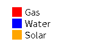
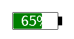
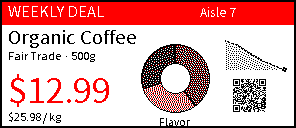
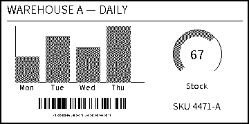

# imagespec

Render images from a declarative **YAML/dict spec** — shapes, text, charts,
QR/barcodes — for e-paper ESL tags and label printers.


This is the shared rendering core extracted from
[`hass-gicisky`](https://github.com/eigger/hass-gicisky) and
[`hass-niimbot`](https://github.com/eigger/hass-niimbot). Both integrations had
near-identical renderers that had drifted apart; `imagespec` unifies them and
removes the Home Assistant dependency so the engine can be reused and tested
standalone.

## Status

✅ **29 elements** (21 ported + 8 new) rendering, with a 97-test suite.
Architecture (HA-decoupled context, registry dispatch, device-specific rotation
+ palette) is in place. Remaining work is packaging polish and switching the two
components over to it.

## Design

- **No framework dependency.** The core never imports Home Assistant. Anything
  host-specific is injected through `RenderContext`:
  - `font_resolver(name) -> path | None` — e.g. an integration's
    `hass.config.path("www/fonts")` lookup.
  - `history_provider(entity_ids, start, end) -> states` — for the `plot`
    element (HA recorder). Optional.
  - `palette` — the device's supported colors (see below).
- **Registry dispatch.** Each element `type` is a handler registered with
  `@element("type")` in `imagespec/elements/`, replacing the original giant
  `if/elif` chain. Adding an element = adding a function.
- **`RenderState`.** Threaded through handlers; holds the (reassignable) `img`
  and the `pos_y` flow cursor.
- **Device-dependent palette** (`RenderContext.palette`), *not* unified — panels
  support different colors. Define it as a **list of the colors the device
  supports** (names, HEX, or RGBA tuples):

  ```python
  RenderContext(palette=["black", "white", "red"])          # names
  RenderContext(palette=["#000000", "#ffffff", "#ff0000"])  # HEX
  RenderContext(palette=[(0, 0, 0), (255, 255, 255)])       # RGBA tuples
  ```

  Shorthand names are optional convenience for common panels: `"2"`/`"bw"`,
  `"3"`/`"bwr"`, `"4"`, `"7"`/`"acep"`. Any requested color in a payload is then
  quantized to the nearest color in this list — on a 2-color device `red`
  becomes black; on 4-color a blue `#1e90ff` becomes white; on 7-color it stays
  blue. Elements are drawn in full color and this mapping is applied to the whole
  image once at the end of `render()` (dithered or flat, per `dither` — see
  *Dithering*).
- **Merged behaviour.** Where the two sources differed, the superset wins:
  - qrcode gains `eclevel` (niimbot)
- **Device-dependent rotation** (`rotate_mode`), *not* unified — both behaviours
  are kept because they are physically different:
  - `"canvas"` (gicisky): background/canvas rotates; output stays `width×height`
    (fixed-resolution e-ink panel).
  - `"image"` (niimbot): drawing rotates; output dimensions swap (variable-size
    label printer).

## Usage

```python
from imagespec import render, RenderContext

ctx = RenderContext(
    font_resolver=my_font_lookup,        # optional
    history_provider=my_history_lookup,  # optional, only for `plot`
)
image = render(payload, width=296, height=128, rotate=0,
               background="white", context=ctx)   # -> PIL.Image (RGB)
```

Run the smoke test (no fonts required):

```bash
pip install -e .
python examples/smoke_test.py
```

## Development & testing

```bash
pip install -e ".[dev,datamatrix]"
pytest                 # 97 tests: every element, palettes, rotation, dither, errors
ruff check . && ruff format --check .   # lint + format
python -m build        # build sdist + wheel (bundles fonts/icons)
```

CI runs on every push/PR (`.github/workflows/ci.yml`): ruff lint+format, the test
suite on Python 3.11/3.12/3.13, and a build that asserts the bundled fonts/icons
are present in the wheel. Pushing a `v*` tag triggers
`.github/workflows/release.yml` to build and publish to PyPI (trusted publishing).

The test matrix (`tests/test_elements.py`) asserts it covers *every* registered
element type, so adding a new `@element(...)` without a sample fails the suite —
keeping coverage exhaustive by construction.

**Robustness built in:**

- Each handler error is wrapped with element context — you get
  `error rendering element #3 (type 'text'): ...`, not a raw PIL traceback.
- `render()` validates `rotate`/`rotate_mode`/size and rejects non-dict elements;
  unknown element types are warned-and-skipped.
- `dlimg` only allows `http(s)`/`data:` URLs by default; local paths require
  `RenderContext(allow_local_images=True)`. Network failures become `RenderError`.
- Clear errors for missing required args, invalid barcode symbology, malformed
  `polygon` points, and a `diagram` too small for its bars.

## Elements

All ported from the original renderers (superset behaviour where they differed):

| Preview | Element | Module | Notes |
|:---:|---|---|---|
|  | `line` | shapes | + dashed lines |
|  | `rectangle` | shapes | |
|  | `rectangle_pattern` | shapes | |
|  | `circle` | shapes | |
|  | `ellipse` | shapes | |
|  | `arc` | shapes | |
|  | `polygon` | shapes | |
|  | `gauge` | shapes | |
|  | `text` | text | + rotation, background box |
|  | `text_box` | text | |
|  | `multiline` | text | |
|  | `new_multiline` | text | fit-to-width/height autosize (niimbot) |
|  | `text_fit` | text | fit text into a fixed box: shrink font / ellipsis / wrap |
|  | `table` | text | |
|  | `qrcode` | codes | + `eclevel` (niimbot) |
|  | `barcode` | codes | |
|  | `datamatrix` | codes | optional dep `pyStrich` (`imagespec[datamatrix]`) |
|  | `icon` | media | Material Design Icons; needs bundled `icons/` assets |
|  | `dlimg` | media | + fit modes (stretch/fit/fill/contain) |
|  | `diagram` | charts | bar chart |
|  | `plot` | charts | needs `history_provider`; + area_fill, xlegend |
|  | `progress_bar` | charts | + rounded corners |
|  | `pie` | charts | **new** — pie / donut (`inner_radius`) |
|  | `sparkline` | charts | **new** — compact axis-less line from inline values |
|  | `rich_text` | text | **new** — inline spans: icon + text + color on one line |
|  | `group` | layout | **new** — container: child elements at an offset, clipped, optionally rotated |
|  | `legend` | widgets | **new** — color-swatch ↔ label rows (vertical/horizontal) for `pie`/`plot` |
|  | `star_rating` | widgets | **new** — full/half/empty stars for rating labels |
|  | `battery` | widgets | **new** — vector battery gauge with proportional fill |

Plus enhancements: `render(..., dither=True)` dithers the whole output and **any
element** can carry its own `dither: true`/`false` to override it just for itself
(Floyd–Steinberg to palette); `dlimg` also gained `circle`/`mask` (circular crop);
`text_fit` fits text into a fixed box (shrink / ellipsis / wrap).

## Payload Specification & Element Reference

Payloads are specified as a list (sequence) of dictionary elements, which can be easily authored in YAML or JSON. Each element requires a `type` string and varying geometric/styling attributes.

### Common Attributes
- **Colors**: Supported color specifications include names (e.g., `"black"`, `"white"`, `"red"`, `"green"`, `"blue"`, `"orange"`, `"yellow"`) or HEX strings (e.g., `"#FF0000"`). Colors are automatically quantized to the host device's palette.
- **Coordinates**: Standard 2D cartesian coordinate system starting at `(0, 0)` at the top-left corner.

### Elements Reference

#### Shapes & Vector Elements
- **`line`**: Draws a line path.
  - `x_start`, `y_start`, `x_end`, `y_end` (int, required)
  - `fill` (color, default: `"black"`)
  - `width` (int, default: `1`)
  - `dash` (list of integers, e.g. `[4, 4]`, optional)
- **`rectangle`**: Draws a square or rectangle.
  - `x_start`, `y_start`, `x_end`, `y_end` (int, required)
  - `fill` (color, optional)
  - `outline` (color, default: `"black"`)
  - `width` (int, default: `1`)
  - `radius` (int, rounded corner radius, default: `0`)
- **`circle`**: Draws a circle.
  - `x`, `y` (int center, required), `radius` (int, required)
  - `fill`, `outline`, `width` (optional)
- **`ellipse`**: Draws an ellipse.
  - `x_start`, `y_start`, `x_end`, `y_end` (int, required)
  - `fill`, `outline`, `width` (optional)
- **`polygon`**: Draws a custom polygon path.
  - `points` (string, list of coordinates separated by semicolons: `"x1,y1;x2,y2;x3,y3"`, required)
  - `fill`, `outline`, `width` (optional)
- **`arc`**: Draws a curved arc path.
  - `x_start`, `y_start`, `x_end`, `y_end` (int bounding box, required)
  - `start_angle`, `end_angle` (int degrees, e.g., `0` to `180` for bottom semi-circle, required)
  - `outline`, `width` (optional)
- **`rectangle_pattern`**: Fills a grid area with a repeating pixel dot-matrix pattern.
  - `x_start`, `y_start` (int, required)
  - `x_size`, `y_size` (int module size, required)
  - `x_repeat`, `y_repeat` (int repetitions, required)
  - `x_offset`, `y_offset` (int spacing between modules, required)
  - `fill` (color, required)

#### Text & Typography
- **`text`**: Standard single-line text layer.
  - `x`, `y` (int anchor position, required)
  - `value` (string to print, required)
  - `color` (default: `"black"`), `size` (default: `12`), `font` (string name, optional)
  - `anchor` (string PIL anchor alignment, e.g. `"lt"`, `"mm"`, `"ma"`, optional)
- **`text_fit`**: Fits text dynamically inside a fixed box by wrapping and shrinking.
  - `x`, `y`, `width`, `height` (int box boundaries, required)
  - `value` (string text, required)
  - `size` (int start size, default: `20`)
  - `min_size` (int minimum shrink size, default: `8`)
  - `max_lines` (int max lines, default: `1`)
  - `fit` (string shrink behavior: `"shrink"`, `"ellipsis"`, `"shrink_ellipsis"`, default: `"shrink"`)
  - `padding` (int, default: `0`), `background`, `outline`, `radius` (optional)
- **`rich_text`**: Draws a single line of text with mixed formatting (text, icons, colors, sizes) side-by-side.
  - `x`, `y` (int, required)
  - `spans` (list of span dicts: `[{"text": "Temp: "}, {"icon": "mdi:fire", "color": "orange"}]`, required)
  - `size` (default: `12`), `align` (left/right/center, default: `"left"`)
- **`table`**: Renders a simple structured table.
  - `x`, `y` (int top-left, required)
  - `columns` (list of column width integers, required)
  - `rows` (list of lists of strings, required)
  - `font_size` (default: `9`), `header_fill`, `header_color`, `cell_color`, `align`, `row_height`

#### Gauges & Charts
- **`gauge`**: Renders a circular gauge indicator.
  - `x`, `y` (int center, required), `radius` (int, required)
  - `progress` (int `0`-`100` percentage value, required)
  - `fill` (progress color), `outline` (background track color), `width` (optional)
- **`progress_bar`**: Renders a linear progress bar.
  - `x_start`, `y_start`, `x_end`, `y_end` (int bounding box, required)
  - `progress` (int `0`-`100` percentage value, required)
  - `direction` (`"right"`, `"left"`, `"up"`, `"down"`, default: `"right"`)
  - `fill`, `background`, `outline`, `width`, `radius`, `show_percentage` (bool, optional)
- **`sparkline`**: Renders a compact axis-less line chart.
  - `x`, `y` (int top-left, required), `width`, `height` (int, required)
  - `values` (list of floats, required)
  - `color` (line color), `fill` (area color below line), `width_line`, `dot_last` (bool, optional)
- **`pie`**: Renders a pie or donut chart segment.
  - `x`, `y` (int center, required), `radius` (int, required)
  - `values` (string semicolon-separated: `"Gas,30,orange;Water,25,blue"`, required)
  - `inner_radius` (int inner donut hole radius, optional)
- **`diagram`**: Renders a bar chart.
  - `x`, `y` (int top-left, required), `width`, `height` (int, required)
  - `bars` (dict: `{"values": "Jan,45;Feb,75", "color": "blue"}`, required)
  - `margin` (int chart padding, default: `20`)

#### Machine-Readable Codes & Media
- **`qrcode`**: Generates a QR Code.
  - `x`, `y` (int top-left, required)
  - `data` (string, required)
  - `boxsize` (int pixels per module, default: `2`), **or** `width`/`height` (int px
    box — the code is scaled square & crisp to fit it, for predictable layout)
  - `color`, `bgcolor`, `border`, `eclevel` (`"l"`, `"m"`, `"q"`, `"h"`, optional)
- **`barcode`**: Generates a standard linear barcode.
  - `x`, `y` (int top-left, required)
  - `data` (string, required)
  - `code` (string format, e.g. `"code128"`, `"ean13"`, default: `"code128"`)
  - **Sizing (easy, pixel-based):** `width` and/or `height` (int px) — scales the
    barcode to fit that box at `(x, y)`, like `dlimg`/`icon`. Give one to scale
    proportionally, or both for an exact box. This is the recommended way to place
    a barcode predictably.
  - **Sizing (physical, advanced):** when `width`/`height` are omitted it uses
    python-barcode's millimetre options — `module_width` (float mm, default `0.2`),
    `module_height` (float mm, default `7.0`), `quiet_zone` (float mm, default `6.5`)
    rendered at `dpi` (int, default `300`). Pixel size then depends on the DPI.
  - `color`, `bgcolor` (quantized to the palette), `font_size`, `text_distance`,
    `write_text` (bool, default `true`) — optional.
- **`datamatrix`**: Generates a DataMatrix 2D code (needs the `datamatrix` extra).
  - `x`, `y`, `data` (required)
  - `boxsize` (int pixels per cell, default: `2`), **or** `width`/`height` (int px box
    — scaled square & crisp to fit, like `qrcode`)
  - `color`, `bgcolor` (optional)
- **`icon`**: Renders a vector icon from Material Design Icons.
  - `x`, `y` (int top-left, required)
  - `value` (string slug, e.g. `"mdi:home"`, required)
  - `size` (int, default: `24`), `color` (optional)
- **`dlimg`**: Downloads and renders an external image (with fit and dithering).
  - `x`, `y`, `xsize`, `ysize` (int box, required)
  - `url` (http/https or base64 data: url, required; local paths need `RenderContext(allow_local_images=True)`)
  - `mode` (`"stretch"`, `"fit"`, `"fill"`, `"contain"`, default: `"stretch"`)
  - `rotate` (int degrees, optional), `timeout` (seconds, default: `30`)
  - `dither` (bool, optional), `mask` (`"circle"`, optional; or `circle: true`)

#### Widgets
- **`legend`**: Draws color-swatch ↔ label rows (companion to `pie`/`plot`).
  - `x`, `y` (int top-left, required)
  - `items` (required) — list of `{"label": ..., "color": ..., "icon": ...}` dicts, or a `"label,color;label,color"` string
  - `orientation` (`"vertical"` / `"horizontal"`, default: `"vertical"`)
  - `shape` (`"square"` / `"circle"` / `"line"`, default: `"square"`)
  - `size` (font size, default: `12`), `swatch_size`, `gap`, `spacing` (optional)
- **`star_rating`**: Renders a star rating.
  - `x`, `y` (int top-left, required)
  - `rating` (float, required), `max` (int stars, default: `5`)
  - `size` (int, default: `16`), `color` (filled, default: `"orange"`), `empty_color`, `spacing`
  - `half` (bool half-stars, default: `true`)
- **`battery`**: Vector battery gauge with a proportional fill.
  - `x`, `y`, `width`, `height` (int box, required)
  - `level` (int/float `0`-`100`, required)
  - `fill`, `background`, `outline`, `radius`, `padding` (optional)
  - `low_threshold` (int, default: `20`), `low_color` (swap fill at/below threshold, optional)
  - `show_percentage` (bool, optional), `text_color` (optional)

### Dithering

`imagespec` supports Floyd–Steinberg dithering to trade spatial resolution for perceived color depth. This is crucial for rendering detailed gradients, shaded spheres, or photo elements on limited-palette screens (like 2-color black/white, 3-color BWR, or 7-color ACeP e-paper panels).

Without dithering, colors are mapped to the nearest palette entry (direct quantization), leading to severe color banding.

#### 1. Gradient & 3D Shading
Dithering creates a natural halftone pattern that simulates smooth shading and eliminates color banding.


#### 2. Font Rendering (Anti-aliasing vs. Dithering)
> [!IMPORTANT]
> **Guidelines for Text:** Avoid dithering on text layers. Dithering anti-aliased font edges creates tiny dot noise, which severely degrades readability on low-resolution e-ink screens. For sharp text, use direct quantization or disable anti-aliasing (`fontmode = "1"`). The built-in `text` element enforces `fontmode = "1"` for this reason.


#### 3. Charts & Solid Fills
Dithering is useful when you have solid color regions (like pie slices or bar diagrams) in colors outside your device palette (e.g. orange on a black/white screen). Dithering simulates these colors with dot patterns to help distinguish segments, though it introduces some edge noise.


#### How palette mapping works
Every element is drawn in **full color**, and the whole image is mapped to
`context.palette` **once at the end** of `render()`. The `dither` flag only picks
*how* that single mapping happens:

- `dither=True` → Floyd–Steinberg halftone: off-palette fills become
  distinguishable dot patterns (an `orange`/`green`/`blue` pie on a 2-color panel
  renders as three different textures instead of collapsing into one black blob).
- `dither=False` (default) → flat nearest color.

Either way the output is **strictly on-palette**. Because mapping is deferred,
in-palette colors (e.g. black text on white) stay crisp under dithering —
Floyd–Steinberg diffuses no error when a pixel already equals a palette color —
while the text guidance above still applies to *off-palette* text you choose to
dither.

```python
ctx = RenderContext(palette="bw")
img = render(payload, 296, 128, dither=True, context=ctx)
# orange/green/blue pie slices -> different dot patterns, not one black blob
```

#### Per-element `dither` override
Any element may carry its own `dither: true`/`false` to override the global flag
just for itself — so you can dither only the parts that benefit (photos, charts)
and keep the rest flat (labels, QR codes), in a single render:

```yaml
- type: dlimg          # this photo -> halftone
  url: "https://…/photo.png"
  xsize: 100
  ysize: 100
  dither: true
- type: pie            # this chart -> halftone (segments stay distinguishable)
  x: 60; y: 60; radius: 40
  values: "Gas,30,orange;Water,25,blue;Elec,45,red"
  dither: true
- type: text           # left flat regardless of the global flag
  x: 10; y: 110
  value: "Energy mix"
```

An element with an explicit `dither` is rendered in isolation and mapped to the
palette immediately (then composited in payload order), so its choice survives
the final whole-image pass. Elements without the key follow the global `dither`
argument. (QR/barcode and black text are pure palette colors, so they stay crisp
under the global flag anyway — set `dither: false` only for *off-palette* content
you want kept solid.)

#### Device samples
Both labels below mix crisp content (text, QR, barcode) with charts authored in
off-palette colors and marked `dither: true` — the charts become halftones so
their segments stay distinguishable, while everything else stays sharp.

**Electronic shelf label — 3-color (black / white / red):**



**Label printer — 2-color (black / white):**



Regenerate them with:
```bash
python examples/generate_dither_labels.py
```

To run the dithering comparison generator yourself:
```bash
python examples/compare_dither.py
```

## Fonts & assets

Bundled in the package (offline baseline):

- `icons/materialdesignicons-webfont.ttf` + `_meta.json` — required by `icon`.
- `fonts/NotoSansKR-Regular.ttf` (default) and `fonts/ppb.ttf` (niimbot default).

Anything else is resolved at runtime, in order: `font_resolver` (host) →
bundled font of the same basename → bundled default. Helpers in
`imagespec.resolvers`:

- `directory_resolver(dir)` — look up fonts in a host directory (e.g. `www/fonts`).
- `caching_resolver(cache_dir, sources)` — **download on first use, cache to
  disk, reuse offline** (internet needed only once per font).
- `chain_resolvers(a, b, ...)` — try several in order.

This is why the core bundles only the essentials (~11 MB) and **not** gicisky's
full 74 MB font set — decorative fonts are better downloaded-and-cached or served
from `www/fonts`.

## Open decisions

- **Default font.** `NotoSansKR-Regular.ttf` (gicisky) vs `ppb.ttf` (niimbot).
  Default is Noto; bundle both so existing payloads render unchanged.

> Resolved: rotation is now a per-device `rotate_mode` (`"canvas"` for gicisky,
> `"image"` for niimbot), and `RenderState.canvas_width/height` always reflect
> the actual drawing surface — so `plot`/`diagram` default extents are
> consistent in both modes.

## Integrating back into the components

Replace each component's renderer with a thin adapter (see
[`docs/migration.md`](docs/migration.md)) and add to `manifest.json`:

```json
"requirements": ["imagespec"]
```
