# Dithering

`imagespec` maps every render to the device palette **once at the end** of
`render()`. The `dither` argument only chooses *how* that mapping happens.

- Off-palette fills (photos, gradients, chart colors the panel cannot show)
  become distinguishable **halftone / ordered patterns**.
- In-palette colors (black text on white, QR/barcodes) stay crisp — error
  diffusion has nothing to spread when a pixel already equals a palette entry.
- The output is always **strictly on-palette**.

> **Text guideline:** Prefer not to dither anti-aliased text. Tiny edge noise
> hurts readability on low-resolution e-ink. Built-in `text` uses `fontmode="1"`
> for this reason. Keep QR/barcodes undithered as well.

Supported methods are those with **medium-or-better e-ink suitability**
(15 dither algorithms + `none`; error diffusion with serpentine scan, plus
Bayer / clustered-dot screens).

Regenerate the comparison images:

```bash
python examples/generate_dither_methods.py
```

## Source scene

Each tile below is the same source (rainbow strip, gray ramp, shaded sphere on a
warm fill) quantized to the given palette.

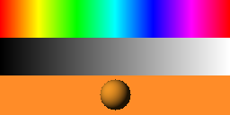

## All methods — black / white

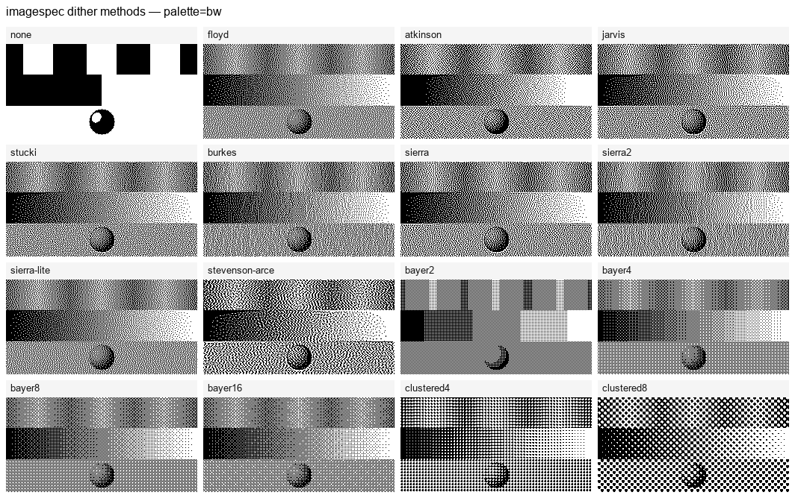

## All methods — black / white / red

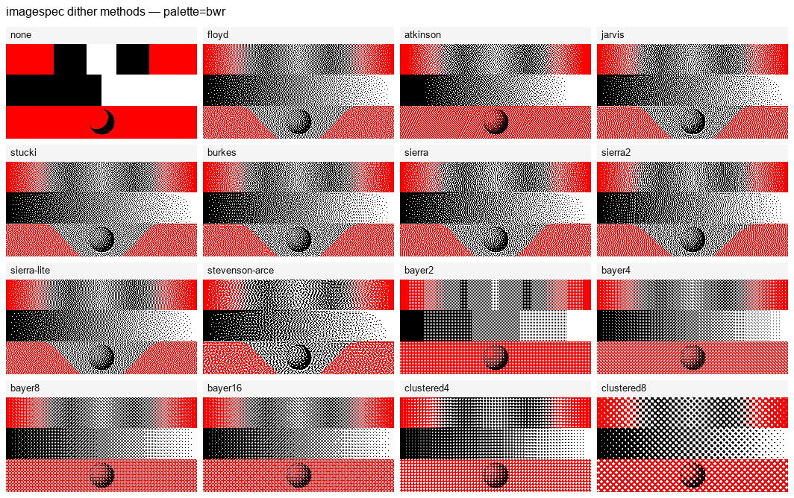

## Usage

```python
from imagespec import RenderContext, render, DITHER_METHODS

ctx = RenderContext(palette="bw")

# Backward compatible
img = render(payload, 296, 128, dither=True, context=ctx)  # = "floyd"
img = render(payload, 296, 128, dither=False, context=ctx)  # = "none"

# Explicit algorithm
img = render(payload, 296, 128, dither="atkinson", context=ctx)
img = render(payload, 296, 128, dither="bayer8", context=ctx)
```

Per-element override (bool or method name) — use on **photos and charts**
(`dlimg`, `pie`, `diagram`, `plot`, `sparkline`, `progress_bar`, `gauge`) when
they use off-palette colors. Leave text/QR/barcodes without `dither`:

```yaml
- type: dlimg
  x: 0
  y: 0
  xsize: 120
  ysize: 80
  url: https://example.com/photo.png
  dither: atkinson
- type: pie
  x: 140
  y: 10
  radius: 40
  values: "A,40,orange;B,60,blue"
  dither: bayer8
- type: diagram
  x: 240
  y: 10
  width: 120
  height: 80
  bars:
    values: "Mon,10;Tue,25;Wed,15"
    color: orange
  dither: floyd
- type: text
  x: 10
  y: 100
  value: Keep me sharp
  # no dither key → follows global flag (prefer global none)
```

## Method gallery (B/W)

Individual tiles for each algorithm on a 2-color palette.

### none

Flat nearest-color snap. Best for text, icons, QR/barcodes.

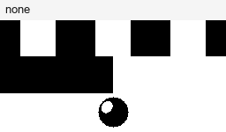

### floyd

Floyd–Steinberg error diffusion (default when `dither=True`). Good general
purpose halftone for photos and charts.

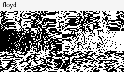

### atkinson

Bill Atkinson’s kernel (only ¾ of the error is diffused). Preserves highlights;
popular on early Mac / e-ink UIs.

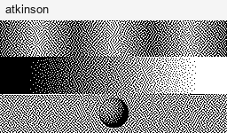

### jarvis

Jarvis–Judice–Ninke — wide kernel, smoother tones, a bit heavier.

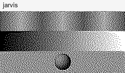

### stucki

Stucki — Jarvis-like quality with a slightly different kernel.


### burkes

Burkes — lighter than Jarvis, still smooth.


### sierra

Sierra-3 — balanced three-row diffusion.


### sierra2

Two-row Sierra — faster, still organic.


### sierra-lite

Minimal Sierra kernel — quick, coarser grain.

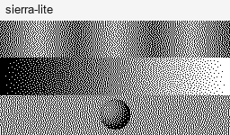

### stevenson-arce

Stevenson–Arce — large kernel, soft grain (medium e-ink suitability).

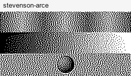

### bayer2 / bayer4 / bayer8 / bayer16

Ordered Bayer matrices. Deterministic patterns; often stable under partial
e-ink refresh. Larger matrices look finer.

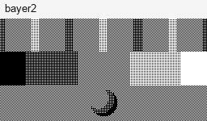

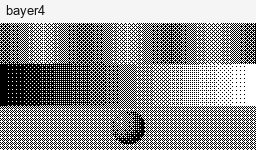


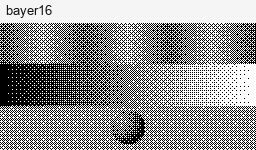

### clustered4 / clustered8

Clustered-dot screens (print / newspaper look). Deterministic like Bayer;
medium e-ink suitability.

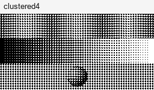

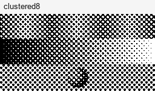

## Choosing a method

| Goal | Suggested methods |
|------|-------------------|
| Default / photos & charts (`dlimg`, `pie`, `diagram`, `plot`, `sparkline`, `progress_bar`, `gauge`) | `floyd`, `atkinson`, `sierra` |
| Softer gradients | `jarvis`, `stucki`, `burkes` |
| Stable ordered pattern (partial refresh) | `bayer8`, `bayer4` |
| Print-like dots | `clustered8` |
| Text / QR / barcode | `none` (or omit dither) |

## API notes

- `True` ≡ `"floyd"`, `False` ≡ `"none"`.
- Aliases: `floyd-steinberg`, `fs`, `jjn`, `sierra3`, `bayer`, `ordered`,
  `clustered-dot-8`, …
- Canonical list: `from imagespec import DITHER_METHODS`.
- Error-diffusion methods use **serpentine** scanning to reduce worm artifacts
  on e-ink.
