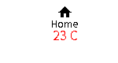
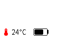
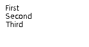
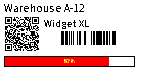

# Element examples

Copy-paste YAML examples for every `imagespec` element type. Each section shows a
**rendered preview** (150×80, 7-color palette) above the YAML you can copy.

Preview images live in [`examples/elements/`](../examples/elements/). Regenerate them after changing sample payloads:

```bash
python examples/generate_element_previews.py
python scripts/inject_element_previews.py   # only if headings changed
```

For field definitions and defaults, see the [Element Reference](../README.md#elements-reference) in the README. For layout patterns and pitfalls, see [`authoring.md`](authoring.md).

> [!TIP]
> All elements support `visible: false` to hide them conditionally (default: `true`).

```python
from imagespec import render, RenderContext

ctx = RenderContext(palette="bw")
img = render(payload, width=400, height=240, background="white", context=ctx)
```

---

## Shapes

### `line`


Straight line, optional dashed stroke.

```yaml
- type: line
  x_start: 10
  y_start: 64
  x_end: 390
  y_end: 64
  fill: black
  width: 2
  dash: [8, 4]
```

### `rectangle`


Filled or outlined rectangle with optional rounded corners.

```yaml
- type: rectangle
  x_start: 10
  y_start: 10
  x_end: 200
  y_end: 80
  fill: black
  outline: black
  width: 2
  radius: 8
  corners: "top_left,top_right"
```

### `rectangle_pattern`


Repeating dot-matrix grid of small rectangles.

```yaml
- type: rectangle_pattern
  x_start: 10
  y_start: 10
  x_size: 8
  y_size: 8
  x_repeat: 20
  y_repeat: 8
  x_offset: 4
  y_offset: 4
  fill: black
```

### `circle`


```yaml
- type: circle
  x: 120
  y: 60
  radius: 40
  fill: red
  outline: black
  width: 2
```

### `ellipse`


Bounding box defines the ellipse.

```yaml
- type: ellipse
  x_start: 20
  y_start: 20
  x_end: 220
  y_end: 100
  fill: blue
  outline: black
  width: 1
```

### `arc`


Arc within a bounding box, angles in degrees.

```yaml
- type: arc
  x_start: 40
  y_start: 10
  x_end: 200
  y_end: 120
  start_angle: 180
  end_angle: 0
  outline: red
  width: 3
```

### `polygon`


Points as `"x,y;x,y;..."`.

```yaml
- type: polygon
  points: "20,180;200,20;380,180"
  fill: blue
  outline: black
  width: 2
```

### `gauge`


Circular progress gauge (0–100).

```yaml
- type: gauge
  x: 200
  y: 120
  radius: 50
  progress: 68
  fill: red
  outline: black
  width: 6
  show_value: true
```

---

## Text

### `text`


Single-line text. Omit `y` to auto-stack below the previous element.

```yaml
- type: text
  x: 10
  y: 10
  value: "Hello World"
  size: 24
  color: black
  font: NotoSansKR-Regular.ttf
  anchor: lt
  align: left
  spacing: 5
  stroke_width: 0
  max_width: 200
```

### `text_box`


Text with a filled background box.

```yaml
- type: text_box
  x: 10
  y: 10
  value: "Status: OK"
  size: 16
  fill: green
  color: white
  radius: 6
```

### `multiline`


Lines split by a delimiter string.

```yaml
- type: multiline
  x: 10
  start_y: 10
  value: "Coffee;Tea;Water"
  delimiter: ";"
  offset_y: 22
  size: 16
  color: black
  anchor: lm
```

### `new_multiline`


Multiline text with optional auto-fit to `width` / `height`.

```yaml
- type: new_multiline
  x: 10
  y: 20
  value: |
    Max Mustermann
    Strassenstraße 33
    49418 Mallorca
  size: 32
  width: 360
  height: 200
  fit: true
  font: NotoSansKR-Regular.ttf
  color: black
```

### `text_fit`


Shrink, wrap, or ellipsize text inside a fixed box.

```yaml
- type: text_fit
  x: 10
  y: 10
  width: 380
  height: 60
  value: "This long label wraps and shrinks to fit the box."
  size: 20
  min_size: 8
  max_lines: 3
  fit: shrink
  padding: 5
  outline: black
  radius: 4
```

### `rich_text`


Inline spans mixing text, icons, and colors on one line.

```yaml
- type: rich_text
  x: 10
  y: 40
  size: 16
  align: left
  spans:
    - text: "Alert: "
    - icon: mdi:fire
      color: orange
      size: 20
    - text: " Active"
      color: red
```

### `table`


Simple grid table.

```yaml
- type: table
  x: 10
  y: 10
  columns: [120, 80, 80]
  rows:
    - ["Item", "Qty", "Price"]
    - ["Apple", "10", "$3.49"]
    - ["Banana", "5", "$1.99"]
  font_size: 12
  header: true
  header_fill: black
  header_color: white
  row_height: 22
```

---

## Codes

### `qrcode`


Use `boxsize` for module size, or `width`/`height` for a fixed pixel box.

```yaml
- type: qrcode
  x: 280
  y: 10
  data: "https://www.home-assistant.io"
  boxsize: 3
  border: 1
  color: black
  bgcolor: white
  eclevel: h
```

Fixed-size box variant:

```yaml
- type: qrcode
  x: 280
  y: 10
  data: "imagespec"
  width: 80
  height: 80
  eclevel: m
```

### `barcode`


Pixel-based sizing (`width`/`height`) is the easiest way to place a barcode.

```yaml
- type: barcode
  x: 10
  y: 160
  data: "123456789012"
  code: code128
  width: 200
  height: 40
  color: black
  bgcolor: white
  write_text: true
```

Physical sizing (millimetres, for print workflows):

```yaml
- type: barcode
  x: 10
  y: 160
  data: "123456789012"
  code: code128
  module_width: 0.2
  module_height: 7
  quiet_zone: 6.5
  font_size: 5
  text_distance: 5.0
  write_text: true
```

### `datamatrix`


Requires the `imagespec[datamatrix]` extra (`pyStrich`).

```yaml
- type: datamatrix
  x: 10
  y: 10
  data: "SKU-12345"
  boxsize: 3
  color: black
  bgcolor: white
```

Fixed-size box variant:

```yaml
- type: datamatrix
  x: 10
  y: 10
  data: "SKU-12345"
  width: 64
  height: 64
```

---

## Media

### `icon`


Material Design Icons (`mdi:`) or Font Awesome Free (`fa:`/`fas:`/`far:`/`fab:`).

```yaml
- type: icon
  x: 10
  y: 10
  value: mdi:weather-sunny
  size: 48
  color: orange
  anchor: la
```

Font Awesome example:

```yaml
- type: icon
  x: 80
  y: 10
  value: fab:github
  size: 40
  color: black
```

### `dlimg`


Image from HTTP(S) URL or base64 data URI. Local paths need
`RenderContext(allow_local_images=True)`.

```yaml
- type: dlimg
  x: 10
  y: 10
  url: "https://example.com/logo.png"
  xsize: 80
  ysize: 80
  mode: contain
  rotate: 0
```

Circular crop and per-element dither:

```yaml
- type: dlimg
  x: 100
  y: 10
  url: "https://example.com/photo.jpg"
  xsize: 100
  ysize: 100
  mode: fill
  circle: true
  dither: true
```

---

## Charts

### `diagram`


Bar chart from semicolon-separated values.

```yaml
- type: diagram
  x: 10
  y: 10
  width: 380
  height: 120
  margin: 20
  bars:
    values: "Mon,10;Tue,25;Wed,15;Thu,30;Fri,20"
    color: blue
    margin: 10
    legend_size: 10
    legend_color: black
```

### `plot`


Time-series chart. Requires `RenderContext(history_provider=...)` — in Home
Assistant integrations this reads from Recorder.

```yaml
- type: plot
  x_start: 30
  y_start: 10
  x_end: 390
  y_end: 180
  duration: 86400
  size: 10
  low: 15
  high: 35
  data:
    - entity: sensor.temperature
      color: red
      width: 2
      area_fill: yellow
  ylegend:
    width: -1
    color: black
    position: left
  yaxis:
    width: 1
    color: black
    tick_width: 2
    tick_every: 5
    grid: 5
    grid_color: black
  debug: false
```

### `progress_bar`


Linear progress indicator (0–100).

```yaml
- type: progress_bar
  x_start: 10
  y_start: 200
  x_end: 390
  y_end: 230
  progress: 75
  direction: right
  background: white
  fill: red
  outline: black
  width: 1
  radius: 4
  show_percentage: true
```

### `pie`


Pie or donut chart. Values: `"label,value,color;..."`.

```yaml
- type: pie
  x: 200
  y: 120
  radius: 60
  inner_radius: 25
  values: "Gas,30,orange;Water,25,blue;Elec,45,red"
  outline: black
  dither: true
```

### `sparkline`


Compact line chart from inline values (no axes).

```yaml
- type: sparkline
  x: 10
  y: 140
  width: 380
  height: 50
  values: [10, 40, 20, 80, 50, 95, 30]
  color: red
  fill: yellow
  width_line: 2
  dot_last: true
```

String form also works:

```yaml
- type: sparkline
  x: 10
  y: 140
  width: 380
  height: 50
  values: "1,3,2,5,4,2,6"
  color: black
```

---

## Layout

### `group`


Container with children positioned relative to the group offset, clipped to its box.

```yaml
- type: group
  x: 20
  y: 20
  width: 200
  height: 100
  elements:
    - type: rectangle
      x_start: 0
      y_start: 0
      x_end: 199
      y_end: 99
      fill: yellow
    - type: text
      x: 100
      y: 50
      value: "Group"
      size: 18
      anchor: mm
```

### `stack` / `row` / `column`

| `column` | `row` | `stack` |
|:---:|:---:|:---:|
|  |  |  |

Auto-layout containers. Children inside a stack **omit `x`/`y`** — the stack
positions them.

Vertical stack:

```yaml
- type: column
  x: 10
  y: 10
  gap: 4
  elements:
    - type: text
      value: "Line 1"
      size: 16
    - type: text
      value: "Line 2"
      size: 16
```

Horizontal row with Tailwind-like `class` shorthand:

```yaml
- type: row
  x: 10
  y: 10
  class: "gap-2 items-center"
  elements:
    - type: icon
      value: mdi:thermometer
      size: 20
      color: red
    - type: text
      value: "24°C"
      size: 18
    - type: battery
      width: 34
      height: 16
      level: 72
      class: "ml-2"
```

`stack` with explicit direction and justification:

```yaml
- type: stack
  x: 10
  y: 10
  width: 380
  direction: horizontal
  gap: 8
  justify: between
  align: center
  elements:
    - type: text
      value: "Living Room"
      size: 18
    - type: battery
      width: 40
      height: 18
      level: 64
```

---

## Widgets

### `legend`


Color swatch ↔ label rows (companion to `pie` / `plot`).

```yaml
- type: legend
  x: 10
  y: 10
  orientation: vertical
  shape: square
  size: 12
  swatch_size: 12
  gap: 6
  items:
    - label: Gas
      color: orange
    - label: Water
      color: blue
      icon: mdi:water
```

String form:

```yaml
- type: legend
  x: 10
  y: 10
  items: "Gas,orange;Water,blue;Solar,yellow"
```

### `star_rating`


```yaml
- type: star_rating
  x: 10
  y: 10
  rating: 3.5
  max: 5
  size: 24
  color: orange
  empty_color: gray
  spacing: 2
  half: true
```

### `battery`


Vector battery gauge.

```yaml
- type: battery
  x: 300
  y: 10
  width: 80
  height: 28
  level: 65
  fill: green
  background: white
  outline: black
  radius: 3
  low_threshold: 20
  low_color: red
  show_percentage: true
  text_color: white
```

---

## Combined label example



A typical 400×240 label mixing layout, text, codes, and a progress bar:

```yaml
- type: column
  x: 10
  y: 10
  width: 380
  class: "gap-2"
  elements:
    - type: text
      value: "Warehouse A-12"
      size: 22
    - type: row
      class: "gap-3 items-center"
      elements:
        - type: qrcode
          data: "https://example.com/item/12345"
          width: 72
          height: 72
        - type: column
          class: "gap-1"
          elements:
            - type: text
              value: "Widget XL"
              size: 18
            - type: barcode
              data: "123456789012"
              width: 180
              height: 36
              write_text: false
    - type: progress_bar
      x_start: 0
      y_start: 0
      x_end: 360
      y_end: 20
      progress: 80
      show_percentage: true
```

Render in Python:

```python
from imagespec import render, RenderContext

payload = [...]  # YAML above
img = render(payload, width=400, height=240, background="white", context=RenderContext(palette="bw"))
img.save("label.png")
```

---

## See also

- [Element Reference](../README.md#elements-reference) — all keys and defaults
- [Authoring guide](authoring.md) — layout model, palette, pitfalls
- [Migration guide](migration.md) — integrating into Home Assistant components
