# Element reference

<!-- GENERATED by scripts/export_schema.py from the @element(..., fields=[...]) declarations. -->
<!-- Edit the declarations next to each handler, then run: python scripts/export_schema.py -->

Every key each element accepts, with its type and default. A payload is a list of these
elements, rendered in order. `schema/elements.json` is the same information as JSON Schema.

- **number** keys also accept numeric strings (`"42"`, `"3.5"`) as produced by templates;
  **boolean** keys accept `"true"`/`"false"`/`"on"`/`"off"`/`"0"`/`"1"`.
- **color** is a name (`black`, `red`, `#ff0000`, `#f00`, any CSS colour name) and is quantized
  to the device palette when the image is finished.
- Omitting an optional key uses the default; an explicit `null` means "none" (e.g. no fill).

See [`elements.md`](elements.md) for a rendered YAML example of every element and
[`authoring.md`](authoring.md) for the layout model.

## Keys accepted by every element

| key | type | default | description |
|---|---|---|---|
| `type` | string | **required** | Element type |
| `visible` | boolean | `true` | `false` (or a template string such as `"False"`, `"off"`, `"0"`) skips the element |
| `dither` | bool \| 0/1 \| method name |  | Per-element palette mapping: `true`/`false` (also `1`/`0` or a template string such as `"False"`) or a dither method name; overrides the render-wide setting for this element only |
| `class` | string |  | Tailwind-like layout classes (`gap-2 items-center grow -ml-1 ...`), read by an enclosing stack/row/column |
| `layout` | object |  | Explicit per-child layout hints for an enclosing stack (same keys as the `class` shorthand) |
| `layout.grow` | number | `0` | Share of leftover main-axis space this child takes (flex-grow) |
| `layout.align` | `start` \| `end` \| `center` \| `stretch` |  | Cross-axis alignment for this child only |
| `layout.self` | `start` \| `end` \| `center` \| `stretch` |  | Alias of `align` |
| `layout.margin` | number |  | All four margins (px) |
| `layout.margin_x` | number |  | Left and right margin |
| `layout.margin_y` | number |  | Top and bottom margin |
| `layout.margin_left` | number |  |  |
| `layout.margin_top` | number |  |  |
| `layout.margin_right` | number |  |  |
| `layout.margin_bottom` | number |  |  |

## Shapes

### `line`

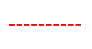

Straight line. Without `y_start` it is drawn at the current flow cursor (after the previous text/line) plus `y_padding`, and the cursor is left on the line.

| key | type | default | description |
|---|---|---|---|
| `x_start` | number | **required** |  |
| `x_end` | number | **required** |  |
| `y_start` | number |  | Omit to place the line at the flow cursor |
| `y_end` | number |  | Defaults to `y_start` (horizontal line) |
| `y_padding` | number | `0` | Gap below the flow cursor when `y_start` is omitted |
| `fill` | color | `"black"` |  |
| `width` | number | `1` |  |
| `dash` | array of number |  | `[on, off]` lengths in px for a dashed line, e.g. `[4, 3]` |

### `rectangle`

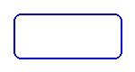

Axis-aligned rectangle, optionally with rounded corners.

| key | type | default | description |
|---|---|---|---|
| `x_start` | number | **required** |  |
| `y_start` | number | **required** |  |
| `x_end` | number | **required** |  |
| `y_end` | number | **required** |  |
| `fill` | color |  | Interior colour; omitted = hollow |
| `outline` | color | `"black"` |  |
| `width` | number | `1` | Outline width |
| `radius` | number |  | Corner radius; default 0, or 10 when `corners` is given |
| `corners` | string |  | `"all"` or a comma list of `top_left`, `top_right`, `bottom_right`, `bottom_left` |

### `rectangle_pattern`

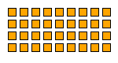

Grid of identical rectangles (dot-matrix / tile pattern).

| key | type | default | description |
|---|---|---|---|
| `x_start` | number | **required** |  |
| `y_start` | number | **required** |  |
| `x_size` | number | **required** | Width of one tile |
| `y_size` | number | **required** | Height of one tile |
| `x_repeat` | number | **required** | Tiles per row |
| `y_repeat` | number | **required** | Tiles per column |
| `x_offset` | number | **required** | Horizontal gap between tiles |
| `y_offset` | number | **required** | Vertical gap between tiles |
| `fill` | color |  |  |
| `outline` | color | `"black"` |  |
| `width` | number | `1` |  |
| `radius` | number |  | Corner radius; default 0, or 10 when `corners` is given |
| `corners` | string |  | As for `rectangle` |

### `circle`

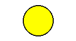

Circle from a centre point and radius.

| key | type | default | description |
|---|---|---|---|
| `x` | number | **required** | Centre x |
| `y` | number | **required** | Centre y |
| `radius` | number | **required** |  |
| `fill` | color |  |  |
| `outline` | color | `"black"` |  |
| `width` | number | `1` |  |

### `ellipse`

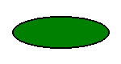

Ellipse inscribed in a bounding box.

| key | type | default | description |
|---|---|---|---|
| `x_start` | number | **required** |  |
| `y_start` | number | **required** |  |
| `x_end` | number | **required** |  |
| `y_end` | number | **required** |  |
| `fill` | color |  |  |
| `outline` | color | `"black"` |  |
| `width` | number | `1` |  |

### `arc`

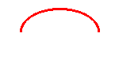

Arc (or pie slice) of the ellipse inscribed in a bounding box. Angles in degrees, clockwise from 3 o'clock.

| key | type | default | description |
|---|---|---|---|
| `x_start` | number | **required** |  |
| `y_start` | number | **required** |  |
| `x_end` | number | **required** |  |
| `y_end` | number | **required** |  |
| `start_angle` | number | **required** |  |
| `end_angle` | number | **required** |  |
| `fill` | color |  | Slice interior when `pie` is true |
| `outline` | color | `"black"` | Arc / slice outline colour |
| `width` | number | `1` |  |
| `pie` | boolean | `false` | Draw a filled pie slice instead of an open arc |

### `polygon`

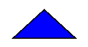

Closed polygon from a point list.

| key | type | default | description |
|---|---|---|---|
| `points` | string | **required** | `"x1,y1;x2,y2;x3,y3"` |
| `fill` | color |  |  |
| `outline` | color | `"black"` |  |
| `width` | number | `1` |  |

### `gauge`

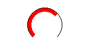

270-degree radial gauge with an optional centred value label.

| key | type | default | description |
|---|---|---|---|
| `x` | number | **required** | Centre x |
| `y` | number | **required** | Centre y |
| `radius` | number | **required** |  |
| `progress` | number | **required** | Value to show, between `min_value` and `max_value` |
| `min_value` | number | `0` |  |
| `max_value` | number | `100` |  |
| `width` | number | `8` | Arc thickness |
| `fill` | color | `"black"` | Filled part of the arc |
| `background` | color | `"white"` | Unfilled part of the arc |
| `outline` | color | `"black"` |  |
| `show_value` | boolean | `false` | Draw `progress` in the centre |
| `font` | string |  |  |
| `size` | number | `16` | Value label font size |
| `color` | color | `"black"` | Value label colour |

## Text

### `text`

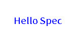

Text. Without `y` it flows below the previous text/line (`y_padding` gap) and advances the cursor. `\n` in `value` starts a new line; `max_width` word-wraps instead.

| key | type | default | description |
|---|---|---|---|
| `x` | number | **required** |  |
| `value` | any | **required** | Text to draw (converted with `str()`) |
| `y` | number |  | Omit to place at the flow cursor |
| `y_padding` | number | `10` | Gap below the flow cursor when `y` is omitted |
| `size` | number | `20` | Font size in px |
| `font` | string |  | Font file name; resolved by the host, else the bundled default |
| `color` | color | `"black"` |  |
| `anchor` | string | `"lt"` | Pillow text anchor (`lt`, `mm`, `rs`, ...); ignored with `max_width` |
| `align` | `left` \| `center` \| `right` | `"left"` | Line alignment for multi-line text |
| `spacing` | number | `5` | Extra px between lines |
| `stroke_width` | number | `0` |  |
| `stroke_fill` | color | `"white"` |  |
| `rotation` | number | `0` | Degrees counter-clockwise; rotated text is composited at `(x, y)` |
| `background` | color |  | Fill a box behind the text |
| `background_padding` | number | `2` | Padding of the background box |
| `max_width` | number |  | Word-wrap to this width in px |

### `text_box`

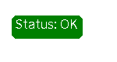

Single-line text on a rounded, filled box sized to the text.

| key | type | default | description |
|---|---|---|---|
| `x` | number | **required** |  |
| `y` | number | **required** |  |
| `value` | any | **required** |  |
| `size` | number | `20` |  |
| `font` | string |  |  |
| `padding` | number | `5` |  |
| `fill` | color | `"black"` | Box colour |
| `color` | color | `"white"` | Text colour |
| `outline` | color |  | Box outline colour |
| `width` | number | `1` | Outline width |
| `radius` | number | `5` | Box corner radius |

### `multiline`

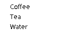

Splits `value` on `delimiter` and draws one line per part, `offset_y` apart. Without `start_y` it flows below the previous text/line.

| key | type | default | description |
|---|---|---|---|
| `x` | number | **required** |  |
| `value` | any | **required** |  |
| `delimiter` | string | **required** | Separator between lines, e.g. `"|"` |
| `offset_y` | number | **required** | Line pitch in px |
| `start_y` | number |  | Omit to place at the flow cursor |
| `y_padding` | number | `10` | Gap below the flow cursor when `start_y` is omitted |
| `size` | number | `20` |  |
| `font` | string |  |  |
| `color` | color | `"black"` |  |
| `anchor` | string | `"lm"` |  |
| `stroke_width` | number | `0` |  |
| `stroke_fill` | color | `"white"` |  |

### `new_multiline`

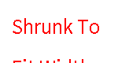

Multi-line text (`\n`-separated) that can shrink its font to fit a `width` and/or `height`.

| key | type | default | description |
|---|---|---|---|
| `x` | number | **required** |  |
| `y` | number | **required** |  |
| `value` | any | **required** |  |
| `size` | number | `20` | Starting font size |
| `spacing` | number |  | Line spacing in px; defaults to `size` |
| `font` | string |  |  |
| `color` | color | `"black"` |  |
| `anchor` | string | `"la"` |  |
| `align` | `left` \| `center` \| `right` | `"left"` |  |
| `stroke_width` | number | `0` |  |
| `stroke_fill` | color |  |  |
| `fit` | any |  | `"width"`, `"height"` or `true` (both) |
| `fit_width` | boolean |  | Shrink until the text is no wider than `width` |
| `fit_height` | boolean |  | Shrink until the text is no taller than `height` |
| `width` | number |  | Target width (required when fitting width) |
| `height` | number |  | Target height (required when fitting height) |

### `table`

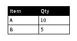

Simple grid: the first row is the header unless `header` is false.

| key | type | default | description |
|---|---|---|---|
| `x` | number | **required** |  |
| `y` | number | **required** |  |
| `columns` | array of number | **required** | Column widths in px |
| `rows` | array of array | **required** | Rows of cell values (each converted with `str()`) |
| `font_size` | number | `14` |  |
| `font` | string |  |  |
| `row_height` | number |  | Defaults to `font_size + 8` |
| `padding` | number | `4` | Horizontal cell padding |
| `header_fill` | color | `"black"` |  |
| `header_color` | color | `"white"` |  |
| `cell_color` | color | `"black"` |  |
| `cell_fill` | color |  | Body cell background |
| `border_color` | color | `"black"` |  |
| `border_width` | number | `1` |  |
| `align` | `left` \| `center` \| `right` | `"left"` |  |
| `header` | boolean | `true` | Treat the first row as a header |

### `rich_text`

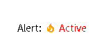

One line of mixed spans (text and icons) with per-span size/colour/font, laid out left to right and vertically centred on `y`.

| key | type | default | description |
|---|---|---|---|
| `x` | number | **required** |  |
| `y` | number | **required** | Vertical centre of the line |
| `spans` | array of objects | **required** | Each span is text (`text`) or an icon (`icon`) |
| `spans[].text` | any |  | Text for a text span |
| `spans[].icon` | string |  | `mdi:name` / `fa:name` for an icon span |
| `spans[].size` | number |  | Defaults to the element `size` |
| `spans[].color` | color |  | Defaults to the element `color` |
| `spans[].font` | string |  | Defaults to the element `font` |
| `spacing` | number | `0` | Gap between spans |
| `size` | number | `20` |  |
| `color` | color | `"black"` |  |
| `font` | string |  |  |
| `align` | `left` \| `center` \| `right` | `"left"` | Position of the whole line relative to `x` |

### `text_fit`

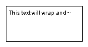

Fits text into a fixed `width` x `height` box: shrink the font, truncate with an ellipsis, or both, with word-wrap up to `max_lines`.

| key | type | default | description |
|---|---|---|---|
| `x` | number | **required** |  |
| `y` | number | **required** |  |
| `width` | number | **required** |  |
| `height` | number | **required** |  |
| `value` | any | **required** |  |
| `fit` | `shrink` \| `ellipsis` \| `shrink_ellipsis` | `"shrink"` |  |
| `size` | number | `20` | Starting font size |
| `min_size` | number | `8` | Smallest size `shrink` may reach |
| `max_lines` | number | `1` |  |
| `line_spacing` | number | `2` |  |
| `ellipsis` | string | `"…"` |  |
| `color` | color | `"black"` |  |
| `align` | `left` \| `center` \| `right` | `"left"` |  |
| `valign` | `top` \| `middle` \| `bottom` | `"top"` |  |
| `padding` | number | `0` |  |
| `font` | string |  |  |
| `background` | color |  | Box fill |
| `outline` | color |  | Box outline |
| `width_outline` | number | `1` |  |
| `radius` | number | `0` | Box corner radius |

## Machine-readable codes

### `qrcode`

QR code. Size it with `boxsize` (px per module) or, for a predictable layout, a pixel `width`/`height` box the code is scaled into (square, crisp).

| key | type | default | description |
|---|---|---|---|
| `x` | number | **required** |  |
| `y` | number | **required** |  |
| `data` | any | **required** | Content to encode |
| `color` | color | `"black"` |  |
| `bgcolor` | color | `"white"` |  |
| `border` | number | `1` | Quiet zone in modules |
| `boxsize` | number | `2` | Pixels per module |
| `eclevel` | `l` \| `m` \| `q` \| `h` | `"h"` | Error-correction level |
| `width` | number |  | Fit into this width (px) |
| `height` | number |  | Fit into this height (px) |

### `barcode`

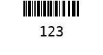

Linear barcode (python-barcode). Give `width`/`height` for pixel-exact sizing; otherwise the millimetre options at `dpi` decide the size.

| key | type | default | description |
|---|---|---|---|
| `x` | number | **required** |  |
| `y` | number | **required** |  |
| `data` | any | **required** | Content to encode |
| `code` | string | `"code128"` | Symbology: `code128`, `ean13`, `code39`, ... |
| `width` | number |  | Scale to this width (px) |
| `height` | number |  | Scale to this height (px) |
| `module_width` | number | `0.2` | mm per module |
| `module_height` | number | `7` | Bar height in mm |
| `quiet_zone` | number | `6.5` | mm |
| `font_size` | number | `5` | pt, for the human-readable text |
| `text_distance` | number | `5.0` | mm between bars and text |
| `bgcolor` | color | `"white"` |  |
| `color` | color | `"black"` |  |
| `write_text` | boolean | `true` | Print the value under the bars |
| `dpi` | number | `300` |  |

### `datamatrix`

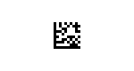

DataMatrix 2D code (needs `imagespec[datamatrix]`). Size like `qrcode`.

| key | type | default | description |
|---|---|---|---|
| `x` | number | **required** |  |
| `y` | number | **required** |  |
| `data` | any | **required** |  |
| `color` | color | `"black"` |  |
| `bgcolor` | color | `"white"` |  |
| `boxsize` | number | `2` | Pixels per cell |
| `width` | number |  | Fit into this width (px) |
| `height` | number |  | Fit into this height (px) |

## Media

### `icon`

Single icon glyph: Material Design Icons (`mdi:home` or bare `home`) or Font Awesome Free (`fa:` auto style, `fas:`/`far:`/`fab:` forced).

| key | type | default | description |
|---|---|---|---|
| `x` | number | **required** |  |
| `y` | number | **required** |  |
| `value` | string | **required** | Icon name with optional prefix |
| `size` | number | **required** | Glyph size in px |
| `color` | color | `"black"` |  |
| `fill` | color |  | Alias of `color` |
| `anchor` | string | `"la"` |  |
| `stroke_width` | number | `0` |  |
| `stroke_fill` | color | `"white"` |  |

### `dlimg`

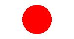

Image from an `http(s)` URL, a `data:` URL or (if the host allows) a local path, resized to `xsize` x `ysize`.

| key | type | default | description |
|---|---|---|---|
| `x` | number | **required** |  |
| `y` | number | **required** |  |
| `url` | string | **required** |  |
| `xsize` | number | **required** | Target width |
| `ysize` | number | **required** | Target height |
| `rotate` | number | `0` | Degrees clockwise, applied before resizing |
| `mode` | `stretch` \| `fit` \| `contain` \| `fill` | `"stretch"` | `fit`/`contain` letterbox, `fill` crops |
| `timeout` | number | `30` | HTTP timeout in seconds |
| `mask` | `circle` |  | `circle` clips the image to a circle |
| `circle` | boolean |  | Alias of `mask: circle` |

## Charts

### `pie`

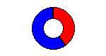

Pie or donut chart. Segment colours cycle through the device palette unless given.

| key | type | default | description |
|---|---|---|---|
| `x` | number | **required** | Centre x |
| `y` | number | **required** | Centre y |
| `radius` | number | **required** |  |
| `values` | string | **required** | `"label,value[,color];..."` |
| `inner_radius` | number | `0` | > 0 makes a donut |
| `start_angle` | number | `-90` | Degrees; -90 starts at 12 o'clock |
| `outline` | color | `"black"` |  |
| `background` | color | `"white"` | Donut hole colour |

### `sparkline`

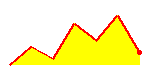

Compact axis-less line chart from inline values.

| key | type | default | description |
|---|---|---|---|
| `x` | number | **required** |  |
| `y` | number | **required** |  |
| `width` | number | **required** |  |
| `height` | number | **required** |  |
| `values` | any | **required** | List of numbers, or a `"1,3,2"` string |
| `min` | number |  | Y range floor; defaults to the data minimum |
| `max` | number |  | Y range ceiling; defaults to the data maximum |
| `color` | color | `"black"` | Line colour |
| `fill` | color |  | Area colour below the line |
| `width_line` | number | `1` |  |
| `joint` | string |  | Pillow line joint, e.g. `curve` |
| `dot_last` | boolean |  | Mark the last value with a dot |
| `dot_radius` | number | `2` |  |
| `dot_color` | color |  | Defaults to `color` |

### `diagram`

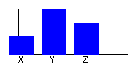

Bar chart with x/y axes.

| key | type | default | description |
|---|---|---|---|
| `x` | number | **required** |  |
| `y` | number | **required** |  |
| `height` | number | **required** |  |
| `width` | number |  | Defaults to the canvas width |
| `margin` | number | `20` | Space reserved for the axes/labels |
| `font` | string |  |  |
| `bars` | object |  | Bar series |
| `bars.values` | string | **required** | `"label,value;label,value"` |
| `bars.color` | color | **required** |  |
| `bars.margin` | number | `10` | Gap between bars |
| `bars.legend_size` | number | `10` | Label font size |
| `bars.legend_color` | color | `"black"` |  |

### `progress_bar`

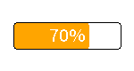

Linear progress bar. `progress` is clamped to 0-100.

| key | type | default | description |
|---|---|---|---|
| `x_start` | number | **required** |  |
| `y_start` | number | **required** |  |
| `x_end` | number | **required** |  |
| `y_end` | number | **required** |  |
| `progress` | number | **required** | Percent, 0-100 |
| `direction` | `right` \| `left` \| `up` \| `down` | `"right"` | Case-insensitive |
| `background` | color | `"white"` |  |
| `fill` | color | `"red"` |  |
| `outline` | color | `"black"` |  |
| `width` | number | `1` | Outline width |
| `radius` | number | `0` |  |
| `show_percentage` | boolean | `false` | Draw `NN%` in the middle |
| `font` | string |  |  |

### `plot`

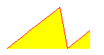

Time-series line chart over the last `duration` seconds, fed by the host's `history_provider`. `low`/`high` widen the y range but never clip data.

| key | type | default | description |
|---|---|---|---|
| `data` | array of objects | **required** | One series per entry |
| `data[].entity` | string | **required** | Entity id passed to the history provider |
| `data[].color` | color | `"black"` |  |
| `data[].width` | number | `1` | Line width |
| `data[].joint` | string |  | Pillow line joint |
| `data[].area_fill` | color |  | Fill below the line |
| `x_start` | number | `0` |  |
| `y_start` | number | `0` |  |
| `x_end` | number |  | Defaults to the canvas right edge |
| `y_end` | number |  | Defaults to the canvas bottom edge |
| `duration` | number | `86400` | Window in seconds ending now |
| `size` | number | `10` | Default legend font size |
| `font` | string |  |  |
| `low` | number |  | Y axis floor (widens only) |
| `high` | number |  | Y axis ceiling (widens only) |
| `debug` | boolean | `false` | Outline the plot and data areas |
| `ylegend` | object |  | Min/max labels; `null` disables |
| `ylegend.width` | number | `-1` | Reserved width; -1 = measure the labels |
| `ylegend.color` | color | `"black"` |  |
| `ylegend.position` | `left` \| `right` | `"left"` |  |
| `ylegend.font` | string |  |  |
| `ylegend.size` | number |  | Defaults to the element `size` |
| `yaxis` | object |  | Axis line, ticks and grid; `null` disables |
| `yaxis.width` | number | `1` | Axis line width |
| `yaxis.color` | color | `"black"` |  |
| `yaxis.tick_width` | number | `2` |  |
| `yaxis.tick_every` | number | `1` | Value step between ticks |
| `yaxis.grid` | number | `5` | Dotted grid spacing in px; `null` disables |
| `yaxis.grid_color` | color | `"black"` |  |
| `xlegend` | object |  | Time labels along the bottom |
| `xlegend.color` | color | `"black"` |  |
| `xlegend.size` | number |  | Defaults to the element `size` |
| `xlegend.font` | string |  |  |
| `xlegend.format` | string | `"%H:%M"` | `strftime` format |
| `xlegend.ticks` | number | `3` | Number of labels |

## Layout containers

### `group`

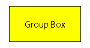

Container: children use coordinates relative to the group's top-left, are clipped to `width` x `height`, and the whole block can be rotated.

| key | type | default | description |
|---|---|---|---|
| `elements` | array of elements | **required** | Child elements, rendered in order. |
| `x` | number | `0` |  |
| `y` | number | `0` |  |
| `width` | number |  | Defaults to the canvas width |
| `height` | number |  | Defaults to the canvas height |
| `rotate` | number | `0` | 0/90/180/270, clockwise |

### `stack` (aliases: `row`, `column`)

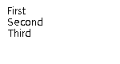

Flexbox-style auto-layout: children need no coordinates; they are measured and packed along the main axis with `gap`, padding, `justify` and `align`. `row` and `column` fix the direction. Each child may carry `class` / `layout` hints.

| key | type | default | description |
|---|---|---|---|
| `elements` | array of elements | **required** | Child elements; their `x`/`y` are ignored (the stack positions them) |
| `direction` | `horizontal` \| `vertical` |  | Defaults to horizontal for `row`, vertical otherwise |
| `gap` | number | `0` |  |
| `justify` | `start` \| `end` \| `center` \| `between` \| `around` \| `evenly` | `"start"` |  |
| `justify_content` | `start` \| `end` \| `center` \| `between` \| `around` \| `evenly` |  | Alias of `justify` |
| `align` | `start` \| `end` \| `center` \| `stretch` | `"start"` | Cross-axis alignment of children |
| `align_items` | `start` \| `end` \| `center` \| `stretch` |  | Alias of `align` |
| `x` | number | `0` |  |
| `y` | number | `0` |  |
| `width` | number |  | Defaults to the canvas width |
| `height` | number |  | Defaults to the canvas height |
| `rotate` | number | `0` | 0/90/180/270, clockwise |
| `padding` | number |  | All sides |
| `padding_x` | number |  |  |
| `padding_y` | number |  |  |
| `padding_left` | number |  |  |
| `padding_top` | number |  |  |
| `padding_right` | number |  |  |
| `padding_bottom` | number |  |  |

## Widgets

### `legend`

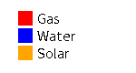

Colour-swatch legend rows (companion to `pie` / `plot`).

| key | type | default | description |
|---|---|---|---|
| `x` | number | **required** |  |
| `y` | number | **required** |  |
| `items` | array of objects \| string | **required** | List of `{label, color, icon?}` dicts, or a `"label,color;label,color"` string |
| `items[].label` | string |  |  |
| `items[].color` | color | `"black"` |  |
| `items[].icon` | string |  | Icon name to use instead of a swatch |
| `size` | number | `12` | Label font size |
| `swatch_size` | number |  | Defaults to `size` |
| `gap` | number | `6` | Swatch to label |
| `spacing` | number | `4` | Between items |
| `orientation` | `vertical` \| `horizontal` | `"vertical"` |  |
| `shape` | `square` \| `circle` \| `line` | `"square"` |  |
| `color` | color | `"black"` | Label colour |
| `font` | string |  |  |

### `star_rating`

Row of full / half / empty stars.

| key | type | default | description |
|---|---|---|---|
| `x` | number | **required** |  |
| `y` | number | **required** |  |
| `rating` | number | **required** |  |
| `max` | number | `5` | Number of stars |
| `size` | number | `16` |  |
| `spacing` | number | `2` |  |
| `half` | boolean | `true` | Allow half stars |
| `color` | color | `"orange"` | Filled stars |
| `empty_color` | color |  | Empty stars; defaults to `color` |

### `battery`

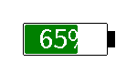

Battery outline with a proportional fill and terminal nub.

| key | type | default | description |
|---|---|---|---|
| `x` | number | **required** |  |
| `y` | number | **required** |  |
| `width` | number | **required** |  |
| `height` | number | **required** |  |
| `level` | number | **required** | Percent, clamped to 0-100 |
| `outline` | color | `"black"` |  |
| `background` | color | `"white"` |  |
| `fill` | color | `"black"` |  |
| `width_outline` | number | `1` |  |
| `radius` | number | `2` |  |
| `padding` | number | `2` | Inset of the fill |
| `low_threshold` | number | `20` |  |
| `low_color` | color |  | Fill colour at or below `low_threshold` |
| `nub_width` | number |  | Defaults to `width / 12` |
| `nub_height` | number |  | Defaults to `height / 2` |
| `show_percentage` | boolean | `false` |  |
| `font` | string |  |  |
| `size` | number |  | Percentage font size; defaults to fit the height |
| `text_color` | color | `"white"` |  |
